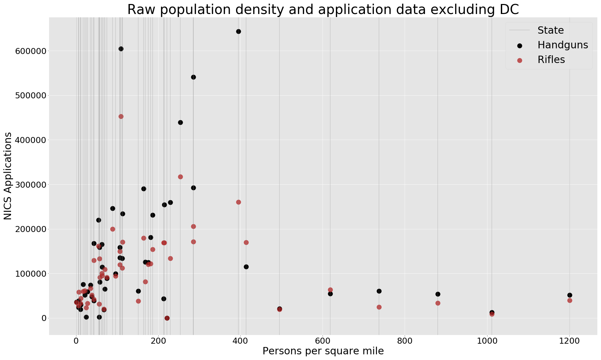
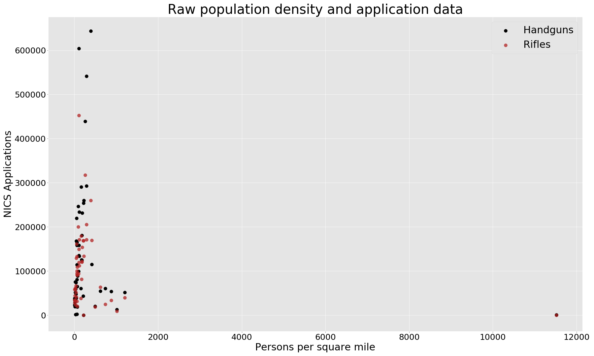

# Capstone1
Project exploring links between NICS(firearm background checks) trends and state populations.

### Table of Contents
[Data](#Data)

[Findings](#Findings)

[Tables](#Tables)

### Team:

- Richard Bellamy

## Data
Credit to Buzzfeed for their opensource data parser
Download NICS data at
 - https://github.com/BuzzFeedNews/nics-firearm-background-checks
Used data in accordance with MIT license


Population density density came from 
 - https://randstatestats.org/us/stats/historical-population-density-(states-only).html

### Problem Domain
Given the knowledge of aproximatly how many background checks were conducted for each type of firearm in each state by year and the population densities of each state by year, do any trends emerge about the types of firearms that background checks are for and the frequency they are requested in comparrison the the states population density?

### Methodology
The NICS data has columns for handgun, long_gun, and other as well as columns for all 3 with various prefixes such as 'prepawn', 'redemption', and 'private sale'.  For the purpose of this study I agregate the sums of these columns into 3 coloumns handgun, long_gun, and other. I'm going to further eliminate the 'other' and 'multiple' coloumns because they aren't pertinent to my experiment.

Population density is measured by persons per quare mile

### Hypothoesis
A) I predict that the ratio of handgun to long gun applications will be higher in states with higher population densities

B) I also predict that states with lower population density will have a higher occurences of rifle applications

C) I predict that states with a higher population density will have a higher occurences of handgun applications. [Null](#Hypothoesis-C-Nullification)

### Prerequisites

- Python 3

```
$python --version
Python 3.7.4
```

- NICS data from data section
Follow link and move file from data folder to folder named data in this repositories root directory

- Population density information
Needs to be in same data folder

## Findings
To see the run book on how these finding were produced please vist the `Capstone.ipynb` file.  You will need a copy of the data sets to run the notebook yourself but you should be able to see the prerun results

I started by making two graphs that I thought would be illustrative to exploring my hypothosis. Graph A is a bar chart where each bar represents a states ratio of handgun to long gun purchases.  The dark line represents the threshold for a 1-1 ratio.

Example:
    
    District of Columbia = 976 handgun applications and 40 rifle applications equate to a 24.4
    Montana = 38393 handgun applications and 58497 rifle applications for a proportion of .66


My problem with this graph is that it is scewed in it's scope by the District of Columbia which is a massive outlier in terms of both population density and proportion of handgun to rifle applications filed.  The median population density is 107 but the mean is 423. This is obviously because of DC at 11,516 with it's next most populas state at 1201. Also it's handgun/rifle application proportion is 24 where the next state with the highest proportion is only 3.16 (Table 1 & 2)  This next graph better shows the differences between states with DC removed


This chart would seem to sugest that, in general, states with higher population density have a higher proportion of applications for handguns to rifles which means it supports my initial hypothoesis A.

Next I chose to chart the raw numbers with a scatter plot so that I could look at the actual number of occurances and propotion of population density change between states.  In the following graph the lines represent a state with that states number of handgun and rifle applications being represented by dots on the each line.  Since we know that DC is such an obvious outlier we are going to begin by looking at a plot with DC's data removed.



Just so we can assure of ourselves of what the data would look like if we included DC here is the same chart but without the state lines and DC included



These two graphs can help me look at my hypotosis B & C.
#### Hypothoesis C Nullification
By looking at these charts I can almost certainly confirm the null hypothosis to H(C).  There is no evidence that states with higher population densities file more applications for handguns.


### Tables
Table 1 = Description of data including DC

|FIELD1|year  |total_handgun     |total_long_gun    |pop_density       |handgun/long_gun   |
|------|------|------------------|------------------|------------------|-------------------|
|count |51.0  |51.0              |51.0              |51.0              |51.0               |
|mean  |2018.0|138054.07843137256|103376.60784313726|423.35861745098043|1.6540754923677627 |
|std   |0.0   |149504.35134601843|85730.34706452048 |1605.7997009585968|3.297578803277349  |
|min   |2018.0|10.0              |31.0              |1.28934           |0.07050341075900181|
|25%   |2018.0|40816.0           |36366.0           |49.28428          |0.9026160053394    |
|50%   |2018.0|80350.0           |91200.0           |107.04415         |1.1951771451060367 |
|75%   |2018.0|174336.5          |151466.0          |225.18950999999998|1.494311656277248  |
|max   |2018.0|643595.0          |452932.0          |11515.65574       |24.4               |


Table 2 = Description of data excluding DC

|FIELD1|year  |total_handgun     |total_long_gun    |pop_density       |handgun/long_gun   |
|------|------|------------------|------------------|------------------|-------------------|
|count |50.0  |50.0              |50.0              |50.0              |50.0               |
|mean  |2018.0|140795.64         |105443.34         |201.51267500000003|1.199157002215119  |
|std   |0.0   |149721.60191989527|85307.67804992583 |264.5673177684518 |0.5710118989817893 |
|min   |2018.0|10.0              |31.0              |1.28934           |0.07050341075900181|
|25%   |2018.0|44137.5           |38391.5           |46.46945          |0.8928885698273171 |
|50%   |2018.0|84545.0           |92793.0           |107.008805        |1.1934184019619565 |
|75%   |2018.0|177639.75         |152579.5          |219.6491175       |1.4740263060688625 |
|max   |2018.0|643595.0          |452932.0          |1201.0947800000001|3.1627863509456446 |
<!--
===========================================================V TEMPLATEING IDEAS V===================================================

Table 1 = Description of data including DC

|FIELD1|year  |total_handgun     |total_long_gun    |pop_density       |handgun/long_gun   |
|------|------|------------------|------------------|------------------|-------------------|
|count |51.0  |51.0              |51.0              |51.0              |51.0               |
|mean  |2018.0|138054.07843137256|103376.60784313726|423.35861745098043|1.6540754923677627 |
|std   |0.0   |149504.35134601843|85730.34706452048 |1605.7997009585968|3.297578803277349  |
|min   |2018.0|10.0              |31.0              |1.28934           |0.07050341075900181|
|25%   |2018.0|40816.0           |36366.0           |49.28428          |0.9026160053394    |
|50%   |2018.0|80350.0           |91200.0           |107.04415         |1.1951771451060367 |
|75%   |2018.0|174336.5          |151466.0          |225.18950999999998|1.494311656277248  |
|max   |2018.0|643595.0          |452932.0          |11515.65574       |24.4               |


Table 2 = Description of data excluding DC

|FIELD1|year  |total_handgun     |total_long_gun    |pop_density       |handgun/long_gun   |
|------|------|------------------|------------------|------------------|-------------------|
|count |50.0  |50.0              |50.0              |50.0              |50.0               |
|mean  |2018.0|140795.64         |105443.34         |201.51267500000003|1.199157002215119  |
|std   |0.0   |149721.60191989527|85307.67804992583 |264.5673177684518 |0.5710118989817893 |
|min   |2018.0|10.0              |31.0              |1.28934           |0.07050341075900181|
|25%   |2018.0|44137.5           |38391.5           |46.46945          |0.8928885698273171 |
|50%   |2018.0|84545.0           |92793.0           |107.008805        |1.1934184019619565 |
|75%   |2018.0|177639.75         |152579.5          |219.6491175       |1.4740263060688625 |
|max   |2018.0|643595.0          |452932.0          |1201.0947800000001|3.1627863509456446 |


I'm chosing to look at data from 1999 through 2018.  This is because my population density data ends in 2018 and my NICS data begins at the end of 1998.  This is also because that is a 20 year span and I like round numbers.
### Installing  

A step by step series of examples that tell you how to get a development env running

Say what the step will be

```
Give the example
```

And repeat

```
until finished
```

End with an example of getting some data out of the system or using it for a little demo

## Running the tests

Explain how to run the automated tests for this system

### Break down into end to end tests

Explain what these tests test and why

```
Give an example
```

### And coding style tests

Explain what these tests test and why

```
Give an example
```

## Deployment

Add additional notes about how to deploy this on a live system

## Built With

* [Dropwizard](http://www.dropwizard.io/1.0.2/docs/) - The web framework used
* [Maven](https://maven.apache.org/) - Dependency Management
* [ROME](https://rometools.github.io/rome/) - Used to generate RSS Feeds

## Contributing

Please read [CONTRIBUTING.md](https://gist.github.com/PurpleBooth/b24679402957c63ec426) for details on our code of conduct, and the process for submitting pull requests to us.

## Versioning

We use [SemVer](http://semver.org/) for versioning. For the versions available, see the [tags on this repository](https://github.com/your/project/tags). 

## Authors

* **Billie Thompson** - *Initial work* - [PurpleBooth](https://github.com/PurpleBooth)

See also the list of [contributors](https://github.com/your/project/contributors) who participated in this project.

## License

This project is licensed under the MIT License - see the [LICENSE.md](LICENSE.md) file for details

## Acknowledgments

* Hat tip to anyone whose code was used
* Inspiration
* etc
-->

