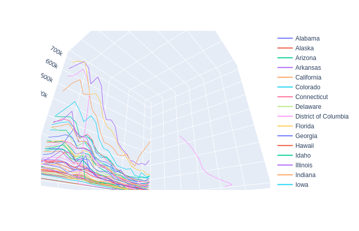

# Links Between State Population Density and NICS Applications 
Project exploring links between NICS(FBI national firearm background checks system) trends and state populations.

### Table of Contents
[Data](#Data)

[Findings](#Findings)

[Tables](#Tables)

Slides @ https://docs.google.com/presentation/d/1p4tVvrS8V48Yg90O-lMksbxnbFtQv3zxQe-bM51BmtE/edit?usp=sharing

### Team:

- Richard Bellamy

## Data
Credit to Buzzfeed for their opensource data parser
Download NICS data at
 - https://github.com/BuzzFeedNews/nics-firearm-background-checks
Used data in accordance with MIT license


Population Density Data:
 - https://randstatestats.org/us/stats/historical-population-density-(states-only).html

### Problem Domain
Given the knowledge of A) how many background checks were conducted for each type of firearm in each state and B) the population densities of each state, do any trends emerge about the types of firearms that background checks are applied for and the frequency they are requested in comparison to the states population density?

### Methodology
The NICS data has columns for handgun, rifle(long guns), and other as well as columns for all 3 with various prefixes such as 'prepawn', 'redemption', and 'private sale'.  For the purpose of this study I aggregate the sums of these columns into 2 columns handgun and long_gun. I'm going to further eliminate the 'other' and 'multiple' columns because they don’t necessarily fall into either of the categories that my experiment is looking at.
 
Population density is measured by persons per square mile

#### Caveat
This data is looking only at applications for background checks and makes no claims about the number of sales.

### Hypothesis
A) I predict that the ratio of handgun to long gun applications will be higher in states with higher population densities. [Support](#Hypothesis-A-Support)
 
B) States in the top half of population densities will have more applications for handguns by raw numbers[Support](#Hypothesis-B-Support)
 
C) I predict that states with a higher population density will have a higher occurrence of handgun applications. [Null](#Hypothesis-C-Nullification)

### Prerequisites

- Python 3

```
$python --version
Python 3.7.4
```

- NICS [Data](#Data)
1. There is a CSV in the data folder titled `nics-firearm-background-checks.csv`
2. Move that file to the data folder in this repos root directory

- Population Density [Data](#Data)
1. For added functionality, get the entire set, to play my runbook you'll need the years 1999 - 2018

## Findings
To see the run book on how these findings were produced please visit the `Capstone.ipynb` file.  You will need a copy of the data sets to run the notebook yourself but you will be able to see the results.
 
I started by making two graphs that I thought would be illustrative to exploring my hypothesis. Graph A is a bar chart where each bar represents a states ratio of handgun to long gun purchases.  The dark line represents the threshold for a 1-1 ratio.
 
Example:

`District of Columbia had 976 handgun applications and 40 rifle applications equate to a 24.4`
  
`Montana had 38393 handgun applications and 58497 rifle applications for a proportion of .66`
 
The black line running horizontally across the graph represents a 1-1 ratio of handgun to rifle applications.  This means states whose bars are above the line have proportionally more applications for handguns then rifles and states with bars below the line have more rifle applications then ones for handguns.
 
The states are sorted from the states with the lowest numbers of persons per square mile on the left and the most dense on the right.

#### Chart 1A


My problem with this graph is that it is skewed in its scope by the District of Columbia which is a massive outlier in terms of both population density and proportion of applications filed for handguns vs rifles.  The median population density is 107 but the mean is 423. This is obviously because of DC at 11,516 with its next most populous state at 1201. Also it's handgun/rifle application proportion is 24 where the next state with the highest proportion is only 3.16 ([Table](#Tables) 1 & 2)  This next graph better shows the differences between states with DC removed

#### Chart 1B


#### Hypothesis A Support
This chart would seem to suggest that, in general, states with higher population density have a higher proportion of applications for handguns to rifles which means it supports my initial Hypothesis(A).  I make this claim because I believe there is an obvious upward trend in chart 1B.  If you look at chart 1A and 2B in conjunction to get an idea of how much of an outlier the District of Columbia is in terms of population density and handgun/longun applications it also seems to support my initial hypothesis.

Next I chose to chart the raw numbers with a scatter plot so that I could look at the actual number of occurrences and proportion of population density change between states.  In the following graph the lines represent each state with that state's number of handgun and rifle applications being represented by dots on the line.  Since we know that DC is such an obvious outlier we are going to begin by looking at a plot with DC's data removed.
 
#### Chart 2A


Just so we can assure ourselves of what the data would look like if we included the District of Columbia, here is the same chart but without the state lines and with DC included.

#### Chart 2B


Here is another example of the last chart but with each population density as the label and evenly spaced along the X axis for easier visualization

#### Chart 2C


#### Hypothesis B Support
The above graph supports my hypothesis B because the black dots are clearly higher on the right half of the graph  
 
#### Hypothesis C Nullification
It supports the null hypothesis to my Hypothesis C because the distribution of red dots is fairly uniform throughout the graph

## Further exploration


This shows a line graph where each line is a state.  The line moving toward us is that state advancing in time from 1999 - 2018 at it's closest point.  The left to right movment signifies that states population density in persons per square meter.  Finally the higher a states line is the more handgun applications there were.  Below is the same graph but for rifle applications


What these graphs say to me is that the largest numbers of applications happen in the middle of the data set and the population density for states did not vary much over our time frame


One last graph including the District of Columbia, it doesn't show much but it looks nice.




### Tables
Table 1 = Description of data including DC

|FIELD1|year  |total_handgun     |total_long_gun    |pop_density       |handgun/long_gun   |
|------|------|------------------|------------------|------------------|-------------------|
|count |51.0  |51.0              |51.0              |51.0              |51.0               |
|mean  |2018.0|138054.07843137256|103376.60784313726|423.35861745098043|1.6540754923677627 |
|std   |0.0   |149504.35134601843|85730.34706452048 |1605.7997009585968|3.297578803277349  |
|min   |2018.0|10.0              |31.0              |1.28934           |0.07050341075900181|
|25%   |2018.0|40816.0           |36366.0           |49.28428          |0.9026160053394    |
|50%   |2018.0|80350.0           |91200.0           |107.04415         |1.1951771451060367 |
|75%   |2018.0|174336.5          |151466.0          |225.18950999999998|1.494311656277248  |
|max   |2018.0|643595.0          |452932.0          |11515.65574       |24.4               |


Table 2 = Description of data excluding DC

|FIELD1|year  |total_handgun     |total_long_gun    |pop_density       |handgun/long_gun   |
|------|------|------------------|------------------|------------------|-------------------|
|count |50.0  |50.0              |50.0              |50.0              |50.0               |
|mean  |2018.0|140795.64         |105443.34         |201.51267500000003|1.199157002215119  |
|std   |0.0   |149721.60191989527|85307.67804992583 |264.5673177684518 |0.5710118989817893 |
|min   |2018.0|10.0              |31.0              |1.28934           |0.07050341075900181|
|25%   |2018.0|44137.5           |38391.5           |46.46945          |0.8928885698273171 |
|50%   |2018.0|84545.0           |92793.0           |107.008805        |1.1934184019619565 |
|75%   |2018.0|177639.75         |152579.5          |219.6491175       |1.4740263060688625 |
|max   |2018.0|643595.0          |452932.0          |1201.0947800000001|3.1627863509456446 |


